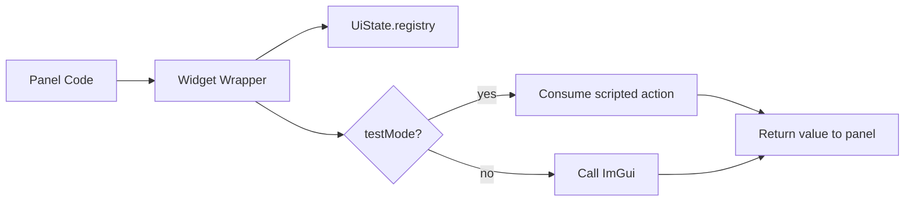
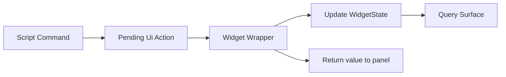
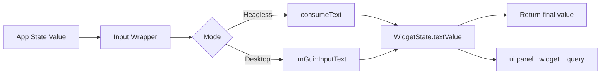
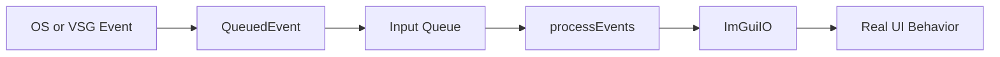
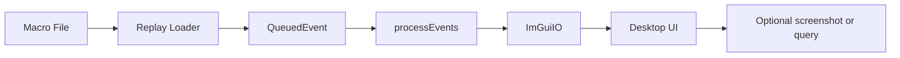

# Testing

This file is the current demo walkthrough for building, running, and explaining the testable UI pattern in `dop-gui`.

## Build

Linux/macOS:

```bash
cmake -S . -B build/dop-gui -DCMAKE_BUILD_TYPE=Release
cmake --build build/dop-gui -j 8
```

Windows:

```bat
build.bat
```

Environment overrides for `build.bat`:

- `BUILD_DIR`
- `BUILD_TYPE`
- `BUILD_JOBS`

Example:

```bat
set BUILD_TYPE=Debug
set BUILD_JOBS=4
build.bat
```

## How UI Testing Works

The important idea is that our widgets are wrapped. We do not call raw ImGui directly from most panels. Instead, panel code goes through helpers in [Widgets.cpp](/home/lgramling/dev/dop-gui/src/Widgets.cpp).

Those wrappers do three jobs:

1. register stable widget ids in `UiState.registry`
2. consume scripted test actions in headless mode
3. call real ImGui in desktop mode

The layout and Yoga code is useful for panel placement, but it is not the core testing idea. The testing pattern is much simpler than the full file makes it look.



## Simplified Widget Examples

Below are stripped-down examples of the pattern behind `Button`, `Checkbox`, and `Input`.

### Button

```cpp
bool Button(UiState& uiState, const char* id)
{
    // Ensure the widget exists in the registry so tests and queries can find it.
    auto& widget = ensureWidget(uiState, id, "button");

    // In headless tests, scripted commands can simulate a click.
    const bool clicked = consumeClick(uiState, id);
    widget.boolValue = clicked;

    // Headless path: do not call ImGui, just return the scripted result.
    if (uiState.testMode)
    {
        return clicked;
    }

    // Desktop path: ask ImGui if the user clicked the real button this frame.
    const bool result = clicked || ImGui::Button(id);
    return result;
}
```

What matters:

- the widget is always registered
- headless mode returns a value from scripted actions
- desktop mode returns a value from real ImGui interaction

### Checkbox

```cpp
bool Checkbox(UiState& uiState, const char* id, bool& value)
{
    auto& widget = ensureWidget(uiState, id, "checkbox");

    // In tests, a script can inject a boolean change.
    const bool simulatedChange = consumeBool(uiState, id, value);
    widget.boolValue = value;

    // Headless path: update the bound value and return whether it changed.
    if (uiState.testMode)
    {
        return simulatedChange;
    }

    // Desktop path: let ImGui render and mutate the bound bool.
    const bool changed = ImGui::Checkbox(id, &value);
    widget.boolValue = value;
    return simulatedChange || changed;
}
```

What matters:

- headless mode mutates the bound value without a window
- desktop mode mutates the same bound value through ImGui
- queries can later read the current checkbox state from `widget.boolValue`

### Input

```cpp
std::string Input(UiState& uiState, const char* id, const std::string& value)
{
    auto& widget = ensureWidget(uiState, id, "input");

    // Start from the model value owned by the panel/app state.
    std::string currentValue = value;

    // In tests, a script can inject replacement text.
    consumeText(uiState, id, currentValue);
    widget.textValue = currentValue;

    // Headless path: return the injected text directly.
    if (uiState.testMode)
    {
        return currentValue;
    }

    // Desktop path: copy to an ImGui buffer and render a real text field.
    std::array<char, 256> buffer{};
    std::snprintf(buffer.data(), buffer.size(), "%s", currentValue.c_str());
    ImGui::InputText(id, buffer.data(), buffer.size());

    // Store the final visible value back into the registry.
    widget.textValue = buffer.data();
    return widget.textValue;
}
```

What matters:

- the same wrapper works for both automated tests and live UI
- headless tests bypass ImGui entirely
- the return value is what the panel should store back into app state

## Headless Path

Headless mode is enabled with:

```bash
./build/dop-gui/dop-gui --ui-test-mode
```

At startup, [App.cpp](/home/lgramling/dev/dop-gui/src/App.cpp) sets:

```cpp
_state.ui.testMode = uiTestMode;
if (_state.ui.testMode) _uiManager->evaluate(_state);
```

That means:

- no desktop window is required
- panels are still evaluated
- widget wrappers still run
- widget state is still registered in `UiState.registry`

So a headless test can:

1. queue a fake action such as `set_text` or `click`
2. evaluate the UI tree
3. inspect widget state through a query



### Headless Example

This script drives the New Shape dialog entirely without a desktop:

```json5
{
  actions: [
    { command: "ui.test.click.menuitem-scene-create" },
    { command: "ui.test.panel.panel-new-shape.set_text.shape-kind=Sphere" },
    { command: "ui.test.panel.panel-new-shape.set_text.position-x=1.50 m" },
    { command: "ui.test.panel.panel-new-shape.click.create-shape" },
    { query: "ui.panel.panel-new-shape.widget.shape-kind" },
    { query: "data.scene.object.sphere_1" },
  ],
}
```

Run it with:

```bash
./build/dop-gui/dop-gui --ui-test-mode --script tests/ui_new_shape_cli.json5
```

### How `Input` Behaves in Headless Mode

Using the real code in [Widgets.cpp](/home/lgramling/dev/dop-gui/src/Widgets.cpp):

```cpp
std::string currentValue = value;
consumeText(uiState, id, currentValue);
widget.textValue = currentValue;
if (uiState.testMode)
{
    return currentValue;
}
```

This means:

- the incoming model value is copied into `currentValue`
- a scripted `set_text` command can replace it
- the registry stores the result in `widget.textValue`
- the wrapper returns that text to the panel immediately

So if the script says:

```text
ui.test.panel.panel-new-shape.set_text.position-x=1.50 m
```

then the next `Input(...)` evaluation returns `"1.50 m"` even though no ImGui widget was rendered.

## Desktop Path

Desktop mode is the normal app run:

```bash
./build/dop-gui/dop-gui
```

In this path:

- a real VSG window is created
- ImGui is initialized
- the same widget wrappers call real ImGui functions

For example, the desktop half of `Input()` is:

```cpp
std::array<char, 256> buffer{};
std::snprintf(buffer.data(), buffer.size(), "%s", currentValue.c_str());
ImGui::InputText(label.c_str(), buffer.data(), buffer.size());
widget.textValue = buffer.data();
return widget.textValue;
```

That means:

- the panel passes in the current model value
- ImGui lets the user edit it with the keyboard
- the wrapper stores the visible result in the widget registry
- the wrapper returns the edited value to the panel

So headless and desktop both follow the same contract:

- input comes in from app state
- wrapper evaluates the widget
- final value comes back out
- widget registry keeps a queryable copy

The only difference is where the edit came from:

- headless: scripted action such as `set_text`
- desktop: real ImGui input from the user



## Query Surface

Queries read the widget registry out of [Query.cpp](/home/lgramling/dev/dop-gui/src/Query.cpp).

Useful query forms:

- `ui.widgets`
- `ui.widget.<widget-id>`
- `ui.panel.<panel-id>.widget.<widget-id>`

Examples:

```bash
./build/dop-gui/dop-gui --ui-test-mode --query ui.widgets
./build/dop-gui/dop-gui --ui-test-mode --query ui.widget.panel-display-grid
./build/dop-gui/dop-gui --ui-test-mode --query ui.panel.panel-new-shape.widget.shape-kind
```

The important part is that queries do not care whether the widget was evaluated in headless mode or desktop mode. They read the same `WidgetState` data:

- `type`
- `boolValue`
- `textValue`
- `layout`
- `panelId`

### `Input` Query Example

If a panel contains:

```cpp
shapeKind = Input(state.ui, "shape-kind", "Shape Kind", shapeKind);
```

then after a headless script sets:

```text
ui.test.panel.panel-new-shape.set_text.shape-kind=Sphere
```

the query:

```bash
./build/dop-gui/dop-gui --ui-test-mode --script tests/ui_new_shape_cli.json5
```

will include a result for:

```text
ui.panel.panel-new-shape.widget.shape-kind
```

and that widget state will report the current text value as `Sphere`.

## Headless Test Demo

Run the focused automated suite:

```bash
ctest --test-dir build/dop-gui --output-on-failure
```

Useful focused runs:

```bash
ctest --test-dir build/dop-gui --output-on-failure -R "dop_gui_ui_registry|dop_gui_ui_background_input|dop_gui_ui_grid_toggle"
ctest --test-dir build/dop-gui --output-on-failure -R "dop_gui_ui_new_shape_panel|dop_gui_ui_scene_create"
```

You can also run individual scripted headless flows directly:

```bash
./build/dop-gui/dop-gui --ui-test-mode --script tests/ui_new_shape_cli.json5
./build/dop-gui/dop-gui --ui-test-mode --script tests/regression_cli.json5
./build/dop-gui/dop-gui --ui-test-mode --query ui.widgets
```

## Live GUI Demo

Desktop helper flows are provided through `test_run.sh`:

```bash
./test_run.sh live-bg
./test_run.sh live-grid-off
./test_run.sh live-scene-cubes
./test_run.sh live-scene-create
./test_run.sh live-regression
```

The most useful end-to-end demo checks are:

1. `./test_run.sh live-regression`
2. `./test_run.sh live-scene-create`

Expected `live-regression` behavior:

1. app opens
2. scene switches to cubes
3. grid hides
4. background turns blue
5. app exits

Expected `live-scene-create` behavior:

1. app opens
2. `Scene -> Create` opens `New Shape`
3. one shape is created
4. dialog is reopened
5. `Cancel` closes it
6. app exits

## Demo Notes

- Headless `ctest` coverage is the authoritative automated safety net.
- Live GUI scripts require a real desktop session; they are not expected to pass in a headless sandbox.
- `imgui.ini` is intentionally local-only state and should not be used as a demo artifact.
- For adding new command/query/UI-test surfaces, use [HowToAddTestCommands.md](/home/lgramling/dev/dop-gui/HowToAddTestCommands.md).

## QA

### How does headless testing work without opening a window or calling Vulkan?

Headless mode exits before the app creates a real viewer, a real window, or any VSG/Vulkan rendering objects.

In [App.cpp](/home/lgramling/dev/dop-gui/src/App.cpp), `--ui-test-mode` sets `ui.testMode` and immediately evaluates the UI tree before the normal desktop startup path runs. If the request is only a script or query, the process returns before it reaches:

- `vsg::Viewer::create()`
- `_inputManager->createWindow()`
- `_visualizer->initialize(...)`

The wrapped widgets in [Widgets.cpp](/home/lgramling/dev/dop-gui/src/Widgets.cpp) check `uiState.testMode`. In that path they:

- consume scripted actions such as `click`, `set_bool`, or `set_text`
- update `UiState.registry`
- return values back to panel code
- skip the real ImGui calls

So headless testing is still evaluating real panel code, but it is doing it as a state machine instead of a rendered desktop UI.

### Are we actually testing widgets in a panel, and how do we catch missing widget calls?

Yes, but headless mode tests the panel logic and widget contract, not the real rendered desktop window.

A widget only appears in the query surface if its wrapper actually ran. The wrapper registers the widget in `UiState.registry` through `ensureWidget(...)` in [Widgets.cpp](/home/lgramling/dev/dop-gui/src/Widgets.cpp). If panel logic accidentally stops calling `Input(...)`, `Button(...)`, or `Checkbox(...)`, that widget never gets registered.

That means headless scripts can catch missing widgets by asserting presence before driving behavior.

Good test pattern:

1. query the panel
2. query the expected widget
3. send the scripted action
4. query the resulting widget or app state

Example queries:

- `ui.panel.panel-new-shape`
- `ui.panel.panel-new-shape.widget.shape-kind`
- `ui.panel.panel-new-shape.widgets`

If the panel logic skips the widget call, the widget query fails immediately. So headless testing can catch:

- widget ids changing unexpectedly
- widgets not being emitted by the panel
- wrappers no longer being called

What it does not catch is real desktop rendering behavior such as focus, docking, OS input, or Vulkan integration. That is what the desktop tests are for.

### Could we use Lavapipe or another offline renderer to capture real desktop tests, and what would we need for panel snapshot images?

Yes, probably, but that would be a different test layer than the current headless widget tests.

Lavapipe can provide a software Vulkan implementation, which means we could run the real rendering path without requiring a physical GPU. That would let us test more of the real desktop stack:

- VSG window creation
- Vulkan-backed ImGui rendering
- panel layout and docking behavior
- actual rendered pixels

But it would still require us to build a screenshot-based test harness. Right now the project does not have that harness.

To support panel snapshot images in desktop tests, we would need to add at least these pieces:

1. a deterministic desktop test mode
   - fixed window size
   - fixed font scale
   - fixed theme/colors
   - fixed startup layout
   - disabled animations or timing-sensitive behavior

2. a software-render-capable CI/runtime path
   - Lavapipe or another software Vulkan driver
   - environment setup so the test run selects that driver reliably

3. a capture mechanism
   - render a frame
   - read back the framebuffer or swapchain image
   - write a PNG artifact for the test

4. a way to isolate a panel or crop panel regions
   - either crop by known panel rectangle from the dock layout
   - or render the target panel in a dedicated test window/layout

5. golden image comparison
   - store approved reference images
   - compare new output with a small tolerance
   - report diffs as test artifacts

6. scriptable desktop test scenes
   - open a panel
   - set known widget values
   - wait for a stable frame
   - capture the image

7. a stable font and asset story
   - packaged fonts
   - predictable DPI/scaling
   - no machine-local theme differences

The important tradeoff is:

- headless widget tests are fast, stable, and good for behavior and data flow
- screenshot-based desktop tests are slower, more fragile, but good for visual regressions and real rendering verification

So the likely best setup is both:

- keep the current headless tests as the main safety net
- add a small number of screenshot-based desktop tests for critical panels

If we wanted to start small, the first useful slice would be:

1. run one scripted desktop test on Lavapipe
2. capture one known panel image
3. save it as an artifact
4. only later add golden-image comparison

### Could we create a testing macro record/playback system?

Yes. The sibling [InputManager.cpp](/home/lgramling/dev/vsgLayt/src/InputManager.cpp) in `vsgLayt` already shows the right foundation for this.

That implementation does two important things:

- it records incoming low-level events into a queue
- it later replays those queued events into `ImGuiIO`

Examples from that file:

- mouse button presses and releases
- pointer move events
- scroll wheel events
- key press and key release events
- window configure events
- frame events used to advance `DeltaTime`

So the basic model is already there:



To turn that into a testing macro record/playback feature, we would add two layers on top of the existing event queue idea.

#### Record mode

In record mode, we would capture each input event and write it to a file with timing information.

Likely recorded fields:

- event type
- mouse position
- button id
- scroll delta
- key code
- modifiers
- window size changes
- frame timing or relative timestamps

For example:

```json5
{
  events: [
    { t: 0.000, type: "configure", width: 1280, height: 720 },
    { t: 0.120, type: "move", x: 410, y: 170 },
    { t: 0.135, type: "button_press", button: 1, x: 410, y: 170 },
    { t: 0.182, type: "button_release", button: 1, x: 410, y: 170 },
    { t: 0.320, type: "key_press", key: "S" },
    { t: 0.340, type: "key_release", key: "S" },
  ],
}
```

#### Playback mode

In playback mode, the app would load that file, inject the recorded events into the same queue, and let the normal `processEvents()` path replay them into `ImGuiIO`.

That would keep the behavior close to real interactive use, because the UI would still be driven by the normal desktop event path.



#### What we would need to add

To make this practical in `dop-gui`, we would need:

1. a serializable event format
   - JSON5 would fit the existing script style well

2. record hooks in the real input path
   - intercept the same events that currently flow into the app
   - write them out with timestamps

3. playback hooks in the input manager
   - read the macro file
   - enqueue events at the right frame or timestamp

4. deterministic frame stepping
   - playback is much more reliable if frame timing is controlled
   - otherwise timing-sensitive drags and text input can drift

5. stable window geometry
   - fixed window size and panel layout
   - otherwise recorded coordinates may not line up on another machine

6. optional assertions after playback
   - run queries after the macro finishes
   - or capture screenshots for visual verification

#### What this would be good for

A macro recorder/playback system would be useful for:

- real drag and drop testing
- menu navigation testing
- keyboard shortcut testing
- docking and panel interaction testing
- screenshot capture after a realistic interaction sequence

#### What it would not replace

It should not replace the current headless widget tests.

The better split is:

- headless tests for fast logic and widget-contract verification
- macro playback for real interactive integration testing
- optional screenshot capture for visual regressions

So the likely path would be:

1. keep the current `ui.test.*` headless actions
2. add `ui.macro.record` / `ui.macro.playback` as a separate desktop-capable layer
3. use playback together with queries and optional screenshots for high-value end-to-end cases
