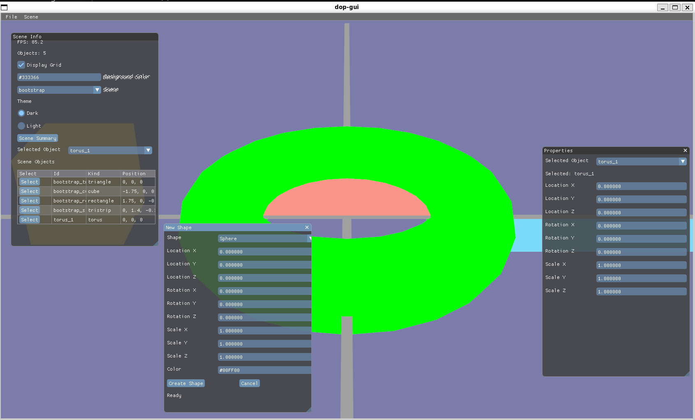
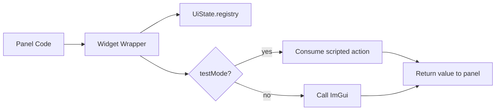
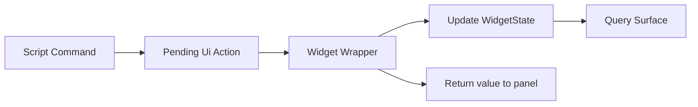
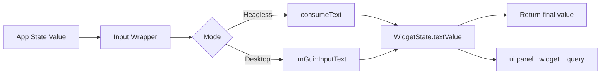
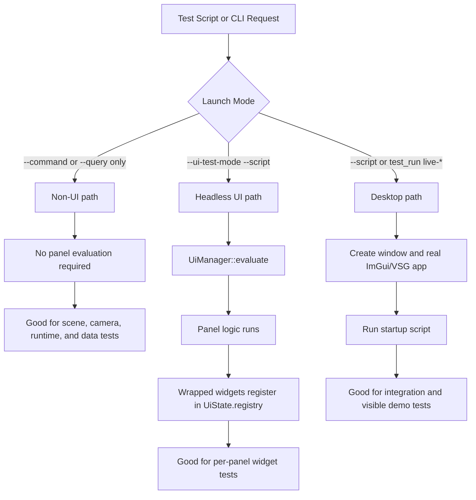
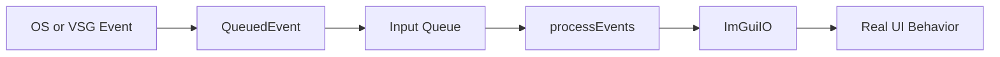
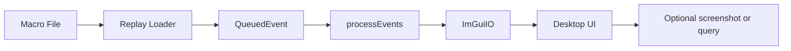

# Declarative Object Properties Testing



This file is the current demo walkthrough for building, running, and explaining the testable UI pattern in Declarative Object Properties (`dop-gui`).

## TL;DR

Our testing approach works because most UI code does not call raw ImGui directly. Instead, panels go through wrapped widgets in [Widgets.cpp](/home/lgramling/dev/dop-gui/src/Widgets.cpp).

Those wrappers add three important capabilities:

1. a stable widget registry
   - each widget gets a consistent id, type, panel id, and current value recorded in `UiState.registry`

2. test-aware logic
   - the same wrapper can either call real ImGui in desktop mode or consume scripted actions in headless mode

3. a query surface
   - tests can ask whether a panel exists, whether a widget was emitted, and what value it currently holds

That is what makes our current test strategy possible. We are not only testing app state after commands. We are also testing that real panel code emits the expected wrapped widgets.

The rest of this document expands on four main ideas:

- testing modes
  - non-UI command/query tests
  - headless UI panel tests
  - desktop integration/demo tests

- scripting
  - JSON5 files under [tests](/home/lgramling/dev/dop-gui/tests) drive commands, queries, and richer action sequences

- panel testing
  - each panel is tested through widget presence, widget actions, and follow-up queries

- future rendering-based testing
  - VSG offscreen rendering or Lavapipe-based CI rendering could add snapshot/image testing later, but that would be a new rendered test layer, not the current headless widget path

## Build

Linux/macOS:

```bash
cmake -S . -B build/dop-gui -DCMAKE_BUILD_TYPE=Release
cmake --build build/dop-gui -j 8
```

Windows:

```bat
build.bat
```

Environment overrides for `build.bat`:

- `BUILD_DIR`
- `BUILD_TYPE`
- `BUILD_JOBS`

Example:

```bat
set BUILD_TYPE=Debug
set BUILD_JOBS=4
build.bat
```

## How UI Testing Works

The important idea is that our widgets are wrapped. We do not call raw ImGui directly from most panels. Instead, panel code goes through helpers in [Widgets.cpp](/home/lgramling/dev/dop-gui/src/Widgets.cpp).

Those wrappers do three jobs:

1. register stable widget ids in `UiState.registry`
2. consume scripted test actions in headless mode
3. call real ImGui in desktop mode

The layout and Yoga code is useful for panel placement, but it is not the core testing idea. The testing pattern is much simpler than the full file makes it look.



## Simplified Widget Examples

Below are stripped-down examples of the pattern behind `Button`, `Checkbox`, and `Input`.

### Button

```cpp
bool Button(UiState& uiState, const char* id)
{
    // Ensure the widget exists in the registry so tests and queries can find it.
    auto& widget = ensureWidget(uiState, id, "button");

    // In headless tests, scripted commands can simulate a click.
    const bool clicked = consumeClick(uiState, id);
    widget.boolValue = clicked;

    // Headless path: do not call ImGui, just return the scripted result.
    if (uiState.testMode)
    {
        return clicked;
    }

    // Desktop path: ask ImGui if the user clicked the real button this frame.
    const bool result = clicked || ImGui::Button(id);
    return result;
}
```

What matters:

- the widget is always registered
- headless mode returns a value from scripted actions
- desktop mode returns a value from real ImGui interaction

### Checkbox

```cpp
bool Checkbox(UiState& uiState, const char* id, bool& value)
{
    auto& widget = ensureWidget(uiState, id, "checkbox");

    // In tests, a script can inject a boolean change.
    const bool simulatedChange = consumeBool(uiState, id, value);
    widget.boolValue = value;

    // Headless path: update the bound value and return whether it changed.
    if (uiState.testMode)
    {
        return simulatedChange;
    }

    // Desktop path: let ImGui render and mutate the bound bool.
    const bool changed = ImGui::Checkbox(id, &value);
    widget.boolValue = value;
    return simulatedChange || changed;
}
```

What matters:

- headless mode mutates the bound value without a window
- desktop mode mutates the same bound value through ImGui
- queries can later read the current checkbox state from `widget.boolValue`

### Input

```cpp
std::string Input(UiState& uiState, const char* id, const std::string& value)
{
    auto& widget = ensureWidget(uiState, id, "input");

    // Start from the model value owned by the panel/app state.
    std::string currentValue = value;

    // In tests, a script can inject replacement text.
    consumeText(uiState, id, currentValue);
    widget.textValue = currentValue;

    // Headless path: return the injected text directly.
    if (uiState.testMode)
    {
        return currentValue;
    }

    // Desktop path: copy to an ImGui buffer and render a real text field.
    std::array<char, 256> buffer{};
    std::snprintf(buffer.data(), buffer.size(), "%s", currentValue.c_str());
    ImGui::InputText(id, buffer.data(), buffer.size());

    // Store the final visible value back into the registry.
    widget.textValue = buffer.data();
    return widget.textValue;
}
```

What matters:

- the same wrapper works for both automated tests and live UI
- headless tests bypass ImGui entirely
- the return value is what the panel should store back into app state

## Headless Path

Headless mode is enabled with:

```bash
./build/dop-gui/dop-gui --ui-test-mode
```

At startup, [App.cpp](/home/lgramling/dev/dop-gui/src/App.cpp) sets:

```cpp
_state.ui.testMode = uiTestMode;
if (_state.ui.testMode) _uiManager->evaluate(_state);
```

That means:

- no desktop window is required
- panels are still evaluated
- widget wrappers still run
- widget state is still registered in `UiState.registry`

So a headless test can:

1. queue a fake action such as `set_text` or `click`
2. evaluate the UI tree
3. inspect widget state through a query



### Headless Example

This script drives the New Shape dialog entirely without a desktop:

```json5
{
  actions: [
    { command: "ui.test.click.menuitem-scene-create" },
    { command: "ui.test.panel.panel-new-shape.set_text.shape-kind=Sphere" },
    { command: "ui.test.panel.panel-new-shape.set_text.position-x=1.50 m" },
    { command: "ui.test.panel.panel-new-shape.click.create-shape" },
    { query: "ui.panel.panel-new-shape.widget.shape-kind" },
    { query: "data.scene.object.sphere_1" },
  ],
}
```

Run it with:

```bash
./build/dop-gui/dop-gui --ui-test-mode --script tests/ui_new_shape_cli.json5
```

### How `Input` Behaves in Headless Mode

Using the real code in [Widgets.cpp](/home/lgramling/dev/dop-gui/src/Widgets.cpp):

```cpp
std::string currentValue = value;
consumeText(uiState, id, currentValue);
widget.textValue = currentValue;
if (uiState.testMode)
{
    return currentValue;
}
```

This means:

- the incoming model value is copied into `currentValue`
- a scripted `set_text` command can replace it
- the registry stores the result in `widget.textValue`
- the wrapper returns that text to the panel immediately

So if the script says:

```text
ui.test.panel.panel-new-shape.set_text.position-x=1.50 m
```

then the next `Input(...)` evaluation returns `"1.50 m"` even though no ImGui widget was rendered.

## Desktop Path

Desktop mode is the normal app run:

```bash
./build/dop-gui/dop-gui
```

In this path:

- a real VSG window is created
- ImGui is initialized
- the same widget wrappers call real ImGui functions

For example, the desktop half of `Input()` is:

```cpp
std::array<char, 256> buffer{};
std::snprintf(buffer.data(), buffer.size(), "%s", currentValue.c_str());
ImGui::InputText(label.c_str(), buffer.data(), buffer.size());
widget.textValue = buffer.data();
return widget.textValue;
```

That means:

- the panel passes in the current model value
- ImGui lets the user edit it with the keyboard
- the wrapper stores the visible result in the widget registry
- the wrapper returns the edited value to the panel

So headless and desktop both follow the same contract:

- input comes in from app state
- wrapper evaluates the widget
- final value comes back out
- widget registry keeps a queryable copy

The only difference is where the edit came from:

- headless: scripted action such as `set_text`
- desktop: real ImGui input from the user



## Query Surface

Queries read the widget registry out of [Query.cpp](/home/lgramling/dev/dop-gui/src/Query.cpp).

Useful query forms:

- `ui.widgets`
- `ui.widget.<widget-id>`
- `ui.panel.<panel-id>.widget.<widget-id>`

Examples:

```bash
./build/dop-gui/dop-gui --ui-test-mode --query ui.widgets
./build/dop-gui/dop-gui --ui-test-mode --query ui.widget.panel-display-grid
./build/dop-gui/dop-gui --ui-test-mode --query ui.panel.panel-new-shape.widget.shape-kind
```

The important part is that queries do not care whether the widget was evaluated in headless mode or desktop mode. They read the same `WidgetState` data:

- `type`
- `boolValue`
- `textValue`
- `layout`
- `panelId`

### `Input` Query Example

If a panel contains:

```cpp
shapeKind = Input(state.ui, "shape-kind", "Shape Kind", shapeKind);
```

then after a headless script sets:

```text
ui.test.panel.panel-new-shape.set_text.shape-kind=Sphere
```

the query:

```bash
./build/dop-gui/dop-gui --ui-test-mode --script tests/ui_new_shape_cli.json5
```

will include a result for:

```text
ui.panel.panel-new-shape.widget.shape-kind
```

and that widget state will report the current text value as `Sphere`.

## How Test Scripts Work

Most automation in this repo is driven by JSON5 files under [tests](/home/lgramling/dev/dop-gui/tests).

The parser in [ScriptRunner.cpp](/home/lgramling/dev/dop-gui/src/ScriptRunner.cpp) supports three main shapes:

1. `commands`
2. `queries`
3. `actions`

### `commands`

`commands` is the simplest form. It is just an ordered list of command strings.

Example:

```json5
{
  commands: [
    "scene.load.cubes",
    "ui.test.set_bool.panel-display-grid=false",
    "app.exit",
  ],
  queries: [],
}
```

Use this when:

- you want a simple scripted sequence
- timing between steps does not matter much
- the app can just run commands in order

### `queries`

`queries` is an ordered list of query names whose results are emitted as structured JSON output.

Example:

```json5
{
  commands: [],
  queries: [
    "ui.widgets",
    "data.scene.selection",
  ],
}
```

Use this when:

- you want to inspect widget or app state
- you want a CTest assertion surface
- you want to verify the output of prior commands

### `actions`

`actions` is a richer ordered list of objects. Each object can contain:

- `command`
- `query`
- `sleepMs`

Example:

```json5
{
  actions: [
    { command: "ui.test.click.menuitem-scene-create" },
    { sleepMs: 1000 },
    { query: "ui.panel.panel-new-shape" },
  ],
}
```

Use this when:

- you need explicit interleaving of commands and queries
- you want sleeps between steps
- you want a more readable integration or headless flow

### Where The Script Runs

The same JSON5 mechanism can drive different runtime layers depending on how the app is launched.



### What Each Path Tests

#### Non-UI command/query path

Examples:

- [tests/smoke_cli.json5](/home/lgramling/dev/dop-gui/tests/smoke_cli.json5)
- [tests/mutate_cli.json5](/home/lgramling/dev/dop-gui/tests/mutate_cli.json5)

These are useful for:

- scene commands
- camera commands
- runtime capability queries
- data-only mutations

They are not panel tests.

#### Headless UI panel path

Examples:

- [tests/ui_background_cli.json5](/home/lgramling/dev/dop-gui/tests/ui_background_cli.json5)
- [tests/ui_grid_cli.json5](/home/lgramling/dev/dop-gui/tests/ui_grid_cli.json5)
- [tests/ui_properties_cli.json5](/home/lgramling/dev/dop-gui/tests/ui_properties_cli.json5)
- [tests/ui_new_shape_cli.json5](/home/lgramling/dev/dop-gui/tests/ui_new_shape_cli.json5)
- [tests/ui_scene_create_cli.json5](/home/lgramling/dev/dop-gui/tests/ui_scene_create_cli.json5)

These are the main panel-level tests.

They verify things like:

- a panel exists
- expected widgets are emitted by the panel
- widget ids and types are stable
- `ui.test.*` actions reach the panel
- panel logic mutates app state correctly
- widget state is queryable afterward

This is how we currently test each UI panel in an automated way.

#### Desktop integration path

Examples:

- [tests/live_regression.json5](/home/lgramling/dev/dop-gui/tests/live_regression.json5)
- [tests/live_ui_scene_create.json5](/home/lgramling/dev/dop-gui/tests/live_ui_scene_create.json5)
- [test_run.sh](/home/lgramling/dev/dop-gui/test_run.sh)
- [test_run.bat](/home/lgramling/dev/dop-gui/test_run.bat)

These are useful for:

- visible end-to-end demos
- checking that startup scripts work in the real desktop app
- integration behavior across window, renderer, input, and UI

These are not as strong as screenshot or macro-replay tests, but they do exercise the real desktop startup path.

### Windows Helper Examples

On Windows, [test_run.bat](/home/lgramling/dev/dop-gui/test_run.bat) exposes both desktop and headless helper modes.

Example help output:

```text
Usage:
  test_run.bat script [script_file] [extra dop-gui args...]
  test_run.bat command [command_text] [extra dop-gui args...]
  test_run.bat rebuild <mode> [mode args...]
  test_run.bat headless-script [script_file] [extra dop-gui args...]
  test_run.bat headless-query [query_text] [extra dop-gui args...]
  test_run.bat headless-bg [extra dop-gui args...]
  test_run.bat headless-grid [extra dop-gui args...]
  test_run.bat headless-scene-click [extra dop-gui args...]
  test_run.bat headless-scene-create [extra dop-gui args...]
  test_run.bat headless-new-shape [extra dop-gui args...]
  test_run.bat headless-properties [extra dop-gui args...]
  test_run.bat headless-regression [extra dop-gui args...]
  test_run.bat live-bg [extra dop-gui args...]
  test_run.bat live-grid-off [extra dop-gui args...]
  test_run.bat live-scene-cubes [extra dop-gui args...]
  test_run.bat live-scene-create [extra dop-gui args...]
  test_run.bat live-regression [extra dop-gui args...]
```

Examples:

```bat
test_run.bat headless-query ui.widgets
test_run.bat headless-scene-click
test_run.bat headless-new-shape
test_run.bat headless-regression
test_run.bat live-scene-create
test_run.bat live-regression
test_run.bat rebuild live-regression
```

Important distinction:

- `headless-*` modes are for `ui_*.json5` and `regression_cli.json5`
- `live-*` modes are for the visible desktop demo scripts
- plain `script` mode is for non-UI or desktop script runs, not the headless `ui_*.json5` panel tests

### Evaluating Results For `headless-scene-click`

This helper runs:

```bat
test_run.bat headless-scene-click
```

which maps to:

```text
build\dop-gui\Release\dop-gui.exe --ui-test-mode --script tests\ui_scene_click_cli.json5
```

That script file is:

```json5
{
  commands: [
    "ui.test.click.menuitem-scene-cubes",
  ],
  queries: [
    "ui.widget.menuitem-scene-cubes",
    "data.scene.objects",
  ],
}
```

The JSON output is meant to be machine-readable. A successful run will emit results for the command and the follow-up queries.

A real example looks like:

```json
{
  "ok": true,
  "commands": [
    {
      "ok": true,
      "command": "ui.test.click.menuitem-scene-cubes",
      "value": {
        "label": "menuitem-scene-cubes",
        "kind": "click"
      }
    }
  ],
  "queries": [
    {
      "ok": true,
      "query": "ui.widget.menuitem-scene-cubes",
      "value": {
        "label": "menuitem-scene-cubes",
        "panelId": "",
        "widgetId": "menuitem-scene-cubes",
        "type": "menuitem"
      }
    },
    {
      "ok": true,
      "query": "data.scene.objects",
      "value": [
        { "id": "cube_left", "kind": "cube" },
        { "id": "cube_center", "kind": "cube" },
        { "id": "cube_right", "kind": "cube" }
      ]
    }
  ]
}
```

What each part means:

- top-level `"ok": true`
  - the script executed successfully as a whole

- `"commands"`
  - the results of each scripted command in order

- command result entry
  - confirms the scripted UI action was accepted
  - for this case, the click on `menuitem-scene-cubes` was queued or applied

- `"queries"`
  - the results of each requested query in order

- `ui.widget.menuitem-scene-cubes` query
  - confirms the widget exists in the registered UI surface
  - proves the panel/menu emitted the expected widget id
  - shows the registered widget type is `menuitem`

- `data.scene.objects` query
  - confirms the application state changed after the click
  - for this case, the cube scene objects should now be present

So this one headless test is verifying three things at once:

1. the UI widget exists
2. the scripted UI action reached it
3. the scene state changed as expected

That is a strong pattern for CI because it checks both UI contract and downstream state mutation.

#### How We Could Use This In CI

There are two practical ways to use this output in a CI pipeline.

##### 1. Through `ctest`

This is the easiest path.

The project already registers CTest cases in [CMakeLists.txt](/home/lgramling/dev/dop-gui/CMakeLists.txt) and uses `PASS_REGULAR_EXPRESSION` to validate the emitted JSON.

So CI can simply run:

```bash
ctest --test-dir build/dop-gui --output-on-failure -R dop_gui_ui_scene_click
```

In that mode:

- the test output stays structured JSON
- CTest checks the expected content
- CI fails automatically if the widget disappears or the scene does not switch

##### 2. Direct script execution plus JSON inspection

CI could also run:

```bat
test_run.bat headless-scene-click
```

or:

```bat
build\dop-gui\Release\dop-gui.exe --ui-test-mode --script tests\ui_scene_click_cli.json5
```

and then inspect the JSON output directly.

That would let a pipeline:

- archive the raw JSON as an artifact
- parse it with PowerShell, Python, or another CI script
- assert on specific keys such as:
  - `"ok": true`
  - `"query": "ui.widget.menuitem-scene-cubes"`
  - cube object ids inside `"data.scene.objects"`

This is useful if we want richer CI reporting than `PASS_REGULAR_EXPRESSION` alone.

So the short version is:

- the headless helper outputs structured JSON
- that JSON is already suitable for CI assertions
- CTest is the simplest current CI path
- direct JSON parsing is the more flexible future path

### Walk Through `Create Shape` Button Click

This is the panel-scoped test command:

```text
ui.test.panel.panel-new-shape.click.create-shape
```

It does not create an object directly. It queues a fake button click and then lets the normal panel logic handle the result.

#### 1. The command is parsed as a panel-scoped UI action

In [Command.cpp](/home/lgramling/dev/dop-gui/src/Command.cpp), the `ui.test.panel.` prefix is recognized as a panel-scoped UI test command.

The path:

```text
ui.test.panel.panel-new-shape.click.create-shape
```

is split into:

- `panelId = "panel-new-shape"`
- `widgetId = "create-shape"`
- `kind = "click"`

#### 2. The command stores a pending click

`executePanelScopedUiClick()` pushes a `UiTestAction` into `state.ui.pendingActions`:

```cpp
UiTestAction{
    .label = "create-shape",
    .panelId = "panel-new-shape",
    .widgetId = "create-shape",
    .kind = "click",
}
```

At this point:

- no scene object has been created yet
- no panel logic has run yet
- the app has only queued a fake button click

#### 3. The panel render reaches the button

Later, when [NewShapePanel.cpp](/home/lgramling/dev/dop-gui/src/NewShapePanel.cpp) is evaluated, it reaches:

```cpp
setNextWidgetLayoutIfPresent(state.ui, layout, "create-shape");
if (ActionButton(state.ui, "create-shape", "Create Shape"))
{
    ...
}
```

`ActionButton(...)` is just a clearer alias for `Button(...)`.

#### 4. The wrapped button consumes the pending click

In [Widgets.cpp](/home/lgramling/dev/dop-gui/src/Widgets.cpp), the wrapped button does:

```cpp
auto& widget = ensureWidget(uiState, id, "button");
const bool clicked = consumeClick(uiState, id);
widget.boolValue = clicked;
if (uiState.testMode)
{
    return clicked;
}
```

Because this is a headless UI test:

- `uiState.testMode` is `true`
- `consumeClick(...)` looks up the queued action for:
  - current panel: `panel-new-shape`
  - widget id: `create-shape`
  - kind: `click`

When it finds the action, it marks it consumed and the wrapped button returns `true`.

#### 5. The normal create-shape logic runs

Because the wrapped button returned `true`, the panel enters its normal button handler in [NewShapePanel.cpp](/home/lgramling/dev/dop-gui/src/NewShapePanel.cpp).

That code:

- validates the color
- converts the shape kind to the scene kind
- creates a new `SceneObjectState`
- pushes it into `state.scene.objects`
- updates `state.scene.selectedObjectId`
- queues `ui.panel.close=panel-new-shape`
- resets the panel form

So the test is not bypassing the panel. It is driving the same code path a real button press would trigger.

#### 6. The button uses the current form values

Usually earlier test commands have already filled in the form, for example:

- `ui.test.panel.panel-new-shape.set_text.shape-kind=Sphere`
- `ui.test.panel.panel-new-shape.set_text.position-x=1.50 m`
- `ui.test.panel.panel-new-shape.set_text.color=#00FF00`

Those values are consumed by the wrapped input fields earlier in the same panel evaluation, so by the time the button click runs, the panel fields already contain the test data.

That means the button click is using the same form state a real user would have created through the UI.

#### 7. The result can be queried

After the button click, a query like:

```text
data.scene.object.sphere_1
```

can verify that the object was really created.

That makes this a strong end-to-end panel test:

1. the panel is open
2. inputs are filled through wrapped widgets
3. the button click is injected through the wrapped button
4. the normal create logic runs
5. the resulting scene object is queried from app state

```mermaid
flowchart LR
    A["ui.test.panel.panel-new-shape.click.create-shape"] --> B["executePanelScopedUiClick()"]
    B --> C["Pending UiTestAction(panel-new-shape, create-shape, click)"]
    C --> D["NewShapePanel::render()"]
    D --> E["ActionButton(state.ui, 'create-shape', 'Create Shape')"]
    E --> F["Button() consumes pending click"]
    F --> G["returns true in testMode"]
    G --> H["normal create-shape handler runs"]
    H --> I["SceneObjectState added to scene"]
    I --> J["ui.panel.close=panel-new-shape queued"]
```



## Headless Test Demo

Run the focused automated suite:

```bash
ctest --test-dir build/dop-gui --output-on-failure
```

Useful focused runs:

```bash
ctest --test-dir build/dop-gui --output-on-failure -R "dop_gui_ui_registry|dop_gui_ui_background_input|dop_gui_ui_grid_toggle"
ctest --test-dir build/dop-gui --output-on-failure -R "dop_gui_ui_new_shape_panel|dop_gui_ui_scene_create"
```

You can also run individual scripted headless flows directly:

```bash
./build/dop-gui/dop-gui --ui-test-mode --script tests/ui_new_shape_cli.json5
./build/dop-gui/dop-gui --ui-test-mode --script tests/regression_cli.json5
./build/dop-gui/dop-gui --ui-test-mode --query ui.widgets
```

## Live GUI Demo

Desktop helper flows are provided through `test_run.sh` on Linux/macOS and `test_run.bat` on Windows.

```bash
./test_run.sh live-bg
./test_run.sh live-grid-off
./test_run.sh live-scene-cubes
./test_run.sh live-scene-create
./test_run.sh live-regression
```

```bat
test_run.bat live-bg
test_run.bat live-grid-off
test_run.bat live-scene-cubes
test_run.bat live-scene-create
test_run.bat live-regression
```

The most useful end-to-end demo checks are:

1. `./test_run.sh live-regression`
2. `./test_run.sh live-scene-create`

Expected `live-regression` behavior:

1. app opens
2. scene switches to cubes
3. grid hides
4. background turns blue
5. app exits

Expected `live-scene-create` behavior:

1. app opens
2. `Scene -> Create` opens `New Shape`
3. one shape is created
4. dialog is reopened
5. `Cancel` closes it
6. app exits

## Demo Notes

- Headless `ctest` coverage is the authoritative automated safety net.
- Live GUI scripts require a real desktop session; they are not expected to pass in a headless sandbox.
- `imgui.ini` is intentionally local-only state and should not be used as a demo artifact.
- For adding new command/query/UI-test surfaces, use [HowToAddTestCommands.md](/home/lgramling/dev/dop-gui/HowToAddTestCommands.md).

## QA

### How does headless testing work without opening a window or calling Vulkan?

Headless mode exits before the app creates a real viewer, a real window, or any VSG/Vulkan rendering objects.

In [App.cpp](/home/lgramling/dev/dop-gui/src/App.cpp), `--ui-test-mode` sets `ui.testMode` and immediately evaluates the UI tree before the normal desktop startup path runs. If the request is only a script or query, the process returns before it reaches:

- `vsg::Viewer::create()`
- `_inputManager->createWindow()`
- `_visualizer->initialize(...)`

The wrapped widgets in [Widgets.cpp](/home/lgramling/dev/dop-gui/src/Widgets.cpp) check `uiState.testMode`. In that path they:

- consume scripted actions such as `click`, `set_bool`, or `set_text`
- update `UiState.registry`
- return values back to panel code
- skip the real ImGui calls

So headless testing is still evaluating real panel code, but it is doing it as a state machine instead of a rendered desktop UI.

### Are we actually testing widgets in a panel, and how do we catch missing widget calls?

Yes, but headless mode tests the panel logic and widget contract, not the real rendered desktop window.

A widget only appears in the query surface if its wrapper actually ran. The wrapper registers the widget in `UiState.registry` through `ensureWidget(...)` in [Widgets.cpp](/home/lgramling/dev/dop-gui/src/Widgets.cpp). If panel logic accidentally stops calling `Input(...)`, `Button(...)`, or `Checkbox(...)`, that widget never gets registered.

That means headless scripts can catch missing widgets by asserting presence before driving behavior.

Good test pattern:

1. query the panel
2. query the expected widget
3. send the scripted action
4. query the resulting widget or app state

Example queries:

- `ui.panel.panel-new-shape`
- `ui.panel.panel-new-shape.widget.shape-kind`
- `ui.panel.panel-new-shape.widgets`

If the panel logic skips the widget call, the widget query fails immediately. So headless testing can catch:

- widget ids changing unexpectedly
- widgets not being emitted by the panel
- wrappers no longer being called

What it does not catch is real desktop rendering behavior such as focus, docking, OS input, or Vulkan integration. That is what the desktop tests are for.

### Could we use Lavapipe or another offline renderer to capture real desktop tests, and what would we need for panel snapshot images?

Yes, probably, but that would be a different test layer than the current headless widget tests.

Lavapipe can provide a software Vulkan implementation, which means we could run the real rendering path without requiring a physical GPU. That would let us test more of the real desktop stack:

- VSG window creation
- Vulkan-backed ImGui rendering
- panel layout and docking behavior
- actual rendered pixels

But it would still require us to build a screenshot-based test harness. Right now the project does not have that harness.

To support panel snapshot images in desktop tests, we would need to add at least these pieces:

1. a deterministic desktop test mode
   - fixed window size
   - fixed font scale
   - fixed theme/colors
   - fixed startup layout
   - disabled animations or timing-sensitive behavior

2. a software-render-capable CI/runtime path
   - Lavapipe or another software Vulkan driver
   - environment setup so the test run selects that driver reliably

3. a capture mechanism
   - render a frame
   - read back the framebuffer or swapchain image
   - write a PNG artifact for the test

4. a way to isolate a panel or crop panel regions
   - either crop by known panel rectangle from the dock layout
   - or render the target panel in a dedicated test window/layout

5. golden image comparison
   - store approved reference images
   - compare new output with a small tolerance
   - report diffs as test artifacts

6. scriptable desktop test scenes
   - open a panel
   - set known widget values
   - wait for a stable frame
   - capture the image

7. a stable font and asset story
   - packaged fonts
   - predictable DPI/scaling
   - no machine-local theme differences

The important tradeoff is:

- headless widget tests are fast, stable, and good for behavior and data flow
- screenshot-based desktop tests are slower, more fragile, but good for visual regressions and real rendering verification

So the likely best setup is both:

- keep the current headless tests as the main safety net
- add a small number of screenshot-based desktop tests for critical panels

If we wanted to start small, the first useful slice would be:

1. run one scripted desktop test on Lavapipe
2. capture one known panel image
3. save it as an artifact
4. only later add golden-image comparison

### Could we create a testing macro record/playback system?

Yes. The sibling [InputManager.cpp](/home/lgramling/dev/vsgLayt/src/InputManager.cpp) in `vsgLayt` already shows the right foundation for this.

That implementation does two important things:

- it records incoming low-level events into a queue
- it later replays those queued events into `ImGuiIO`

Examples from that file:

- mouse button presses and releases
- pointer move events
- scroll wheel events
- key press and key release events
- window configure events
- frame events used to advance `DeltaTime`

So the basic model is already there:



To turn that into a testing macro record/playback feature, we would add two layers on top of the existing event queue idea.

#### Record mode

In record mode, we would capture each input event and write it to a file with timing information.

Likely recorded fields:

- event type
- mouse position
- button id
- scroll delta
- key code
- modifiers
- window size changes
- frame timing or relative timestamps

For example:

```json5
{
  events: [
    { t: 0.000, type: "configure", width: 1280, height: 720 },
    { t: 0.120, type: "move", x: 410, y: 170 },
    { t: 0.135, type: "button_press", button: 1, x: 410, y: 170 },
    { t: 0.182, type: "button_release", button: 1, x: 410, y: 170 },
    { t: 0.320, type: "key_press", key: "S" },
    { t: 0.340, type: "key_release", key: "S" },
  ],
}
```

#### Playback mode

In playback mode, the app would load that file, inject the recorded events into the same queue, and let the normal `processEvents()` path replay them into `ImGuiIO`.

That would keep the behavior close to real interactive use, because the UI would still be driven by the normal desktop event path.



#### What we would need to add

To make this practical in `dop-gui`, we would need:

1. a serializable event format
   - JSON5 would fit the existing script style well

2. record hooks in the real input path
   - intercept the same events that currently flow into the app
   - write them out with timestamps

3. playback hooks in the input manager
   - read the macro file
   - enqueue events at the right frame or timestamp

4. deterministic frame stepping
   - playback is much more reliable if frame timing is controlled
   - otherwise timing-sensitive drags and text input can drift

5. stable window geometry
   - fixed window size and panel layout
   - otherwise recorded coordinates may not line up on another machine

6. optional assertions after playback
   - run queries after the macro finishes
   - or capture screenshots for visual verification

#### What this would be good for

A macro recorder/playback system would be useful for:

- real drag and drop testing
- menu navigation testing
- keyboard shortcut testing
- docking and panel interaction testing
- screenshot capture after a realistic interaction sequence

#### What it would not replace

It should not replace the current headless widget tests.

The better split is:

- headless tests for fast logic and widget-contract verification
- macro playback for real interactive integration testing
- optional screenshot capture for visual regressions

So the likely path would be:

1. keep the current `ui.test.*` headless actions
2. add `ui.macro.record` / `ui.macro.playback` as a separate desktop-capable layer
3. use playback together with queries and optional screenshots for high-value end-to-end cases

### If we had a simulator running in the app `run()` while loop, and we needed to query scene and UI panels, do our current non-UI, headless, and desktop test paths let us run script commands and queries?

Partially, but not equally well.

All three paths can execute commands and queries today, but only the desktop path naturally matches a simulator that advances continuously inside the main app loop.

#### Non-UI path

This path is good for:

- static commands
- data queries
- scene and camera mutations

But it is not a good fit for a simulator that only advances while the real app loop is running frame by frame. In that path, tests typically execute commands and queries directly rather than living inside a long-running simulation loop.

#### Headless UI path

This path is good for:

- panel logic
- widget state
- panel queries
- scripted UI actions through `ui.test.*`

But it is still not a true continuously updating desktop simulation path. It evaluates the UI without creating the full rendered desktop app. So if a simulator only advances inside the real frame loop, headless UI tests would not fully exercise that behavior unless we add explicit simulation stepping commands.

#### Desktop path

This is the best current fit for a simulator running in the app loop.

In the desktop path:

- the real app loop runs
- scene updates can advance each frame
- startup scripts can still issue commands
- queries can still inspect scene and UI state

So if the simulator lives in the normal frame/update loop, the desktop test path is the one that already matches that model.

#### Practical conclusion

Today:

- desktop path works best for a live simulator
- non-UI path works for static or explicitly stepped state changes
- headless UI path works for panel/widget logic, but not a true continuously updating simulator unless that simulator is separately step-driven

If we want all three paths to support simulation testing cleanly, the missing piece is explicit simulation control commands, for example:

- `sim.step=1`
- `sim.step.ms=100`
- `sim.run.frames=60`
- `sim.pause`
- `sim.resume`

With that kind of surface:

- non-UI tests could step the simulator deterministically
- headless UI tests could query panels against changing sim state
- desktop tests could still run the full live loop

So the short answer is:

- yes, all current paths support commands and queries
- no, they do not all support a continuous run-loop simulator equally well
- desktop is the current best match for that use case

### Does VSG have a headless or offscreen mode where we could run in CI, use Lavapipe or simulator commands, and save Vulkan-rendered images when requested?

Likely yes, but that would be a new rendered test layer, not the same as the current pure headless UI path.

VSG supports offscreen buffers as part of its rendering model, which means it should be possible to build an offscreen-render test mode that renders without a visible desktop window. Lavapipe is also a reasonable software Vulkan backend for CI, so the combination is a plausible path for cross-platform automated image capture.

That would let us do things like:

- run the real render path in CI
- advance a simulator
- issue commands or queries during the run
- request a rendered image at a known point
- save the result as a PNG artifact

But this is not what the current `--ui-test-mode` does.

Current `--ui-test-mode`:

- evaluates panel logic
- consumes scripted widget actions
- does not create the full rendering path
- does not produce rendered pixels

So if we want rendered snapshots or frame captures, we would need a separate offscreen rendering mode, for example:

- `--offscreen-test-mode`

That new mode would need:

1. real VSG/Vulkan initialization without a visible desktop window
2. a software-render-capable CI path such as Lavapipe
3. deterministic window size, DPI, fonts, and layout
4. a framebuffer readback path
5. PNG writing
6. test commands that trigger capture at the right time

Good uses for this mode would be:

- simulator frame captures
- scene regression images
- panel snapshot images
- screenshot-based integration tests

The likely best long-term split is:

- non-UI tests for commands, queries, and data mutation
- headless UI tests for panel/widget logic
- desktop tests for visible integration checks
- offscreen rendered tests for CI image capture and visual regression

So the short answer is:

- yes, VSG plus Lavapipe looks like a viable offscreen CI testing path
- but it would require a new offscreen rendered test mode in this app
- it would complement the current test paths rather than replace them
